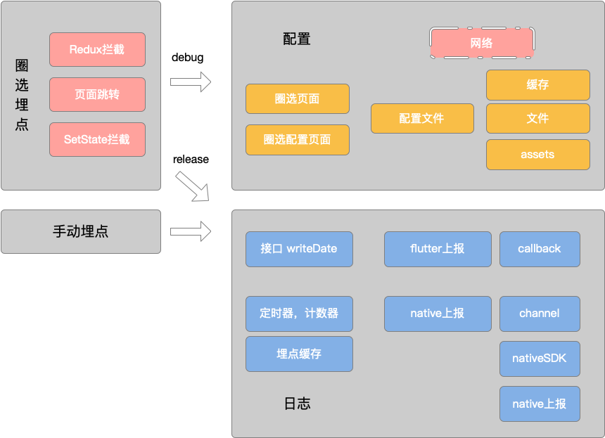
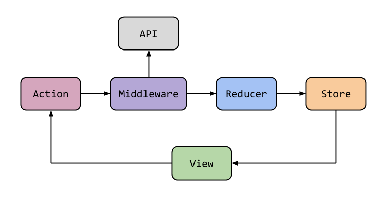
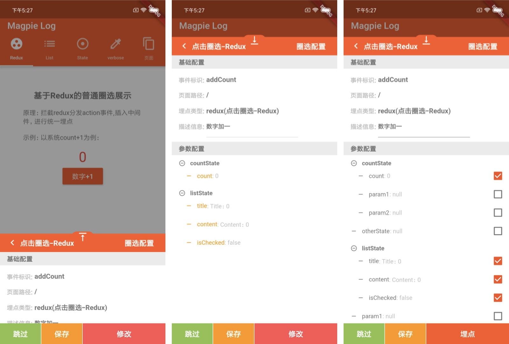
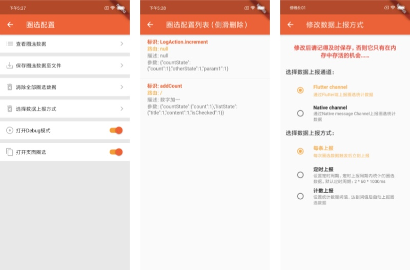

[toc]

作者：58 Magpie技术团队

-------

# 背景
由于flutter还是一个比较新的技术，flutter的埋点方案还是停留在手动埋点，这样开发效率低，耦合严重；因此我们为flutter提供一套圈选埋点的解决方案，使埋点配置，选参可视化，便捷化，动态化，而且基于redux的特点我们可以解决传统圈选埋点无法选参的问题。
# 架构

架构主要分为4个部分，圈选，配置，埋点，日志。

圈选埋点主要做了三种事件的拦截，页面级别事件基于Redux拦截action事件；页面跳转事件基于Navigator拦截页面跳转事件；局部点击刷新事件通过拦截setState方法实现。

配置部分主要为圈选埋点服务，包括配置的UI部分，圈选页面圈选配置页面等。配置管理部分主要是对配置文件的管理包括写入，读取拷贝，文件化存储等，将来可以通过服务网络下发配置，进一步简化流程同时何以实现埋点的动态化配置。

手动埋点因为圈选埋点不可能覆盖100%的埋点，因此我们提供了手动埋点的能力，最终在运行时和圈选埋点走同一套上传逻辑，这样做统一接口，统一逻辑，使接入更加的方便，全面。

日志部分指的是release模式下，上报埋点日志，我们通过api统一收集圈选和手动埋点的数据，为保证flutter和native频繁交互影响性能，我们提供给了定时器和计数器，并且提供了flutter上报和native上报两种方式供用户选择。


# 圈选

这块是我们花了大量时间探索的地方，一度怀疑人生。设计之初我们一直沉浸于向native一样想找到拦截所有点击事件的方式，可以实现，但是十分复杂，而且非常不好维护。没有onclick。我们找到GestureDetector拦截ontap,由于Widget本身没有树，无法获取树形结构，再加上没有viewid，我们无法获取唯一标识，我们想用GlobalKey替代；一切好像可以实现，但是一切却又在逆天而行。其实最大的问题是我们一直在用native的思路去想flutter，及时实现，圈选埋点的条件也过于苛刻，整个工程引用起来也会过于沉重。最后我们统一思想，全部推翻重来，撇弃native的逻辑驱动，撇弃aop，迎合flutter的数据驱动，状态管理；从拦截点击事件，到拦截redux状态管理的action事件，局部刷新事件，我们通过拦截setState()方法。

## redux拦截实现
如果你的工程不是基于flutter，那么很遗憾，你的项目一定是下面两种之一：过于简单，或者状态管理混乱。


你的项目不太适用我们的圈选，或者你可以看下面的setState部分，
如果你使用了redux，那么恭喜你，你的app非常的优秀，至少你需要状态管理，只需要简单的设置，即可使用我们的圈选功能。

下图是flutter-redux的原理图

我们的圈选主要拦截的是Middleware这个部分，因为这个部分对原有逻辑的影响最小。

```
class CircleMiddleWare extends MiddlewareClass<LogState> {
  @override
  void call(Store<LogState> store, action, NextDispatcher next) {
    LogState logState = store.state;
    Map<String, dynamic> json = logState.toJson();
    String actionName =
        action is LogAction ? action.actionName : action.toString();
    String pagePath = MagpieLog.instance.getCurrentPath();
    if (MagpieLog.instance.isDebug) {
      ///进入圈选页面
    } else {
      ///埋点并且走原有逻辑
    }
  }
}
```

## list类型拦截
这里单拉出来讲一下列表点击事件的拦截，主要原因是列表数据结构较特殊，除了拦截事件还要拦截事件触发在列表的位置，在圈选参数和和配置上传上，都需要特殊处理。
```
store.dispatch(LogAction(actionAddCount));
```
```
store.dispatch(LogAction(actionListClick, index: index));
```
可以看到列表页埋点需要多配置index属性。
参数和配置上传在后面详细说明。

## 页面跳转拦截实现
页面跳转的拦截主要通过NavigateObserve

```
class LogObserver<S> extends NavigatorObserver {
  @override
  void didPush(Route route, Route previousRoute) async {
    // 当调用Navigator.push时回调
    MagpieLog.instance.routeStack.add(route);
    super.didPush(route, previousRoute);
    if (!route.settings.name.startsWith("/magpie_log")) {
      await Future.delayed(Duration(milliseconds: 500));
      try {
        LogState logState =
            StoreProvider.of<S>(route.navigator.context).state as LogState;
        var json = logState.toJson();
        String actionName =
            route.settings.name != null ? route.settings.name : "";
        String pagePath = MagpieLog.instance.getCurrentPath();
        if (MagpieLog.instance.isDebug && MagpieLog.instance.isPageLogOn) {
            ///进入圈选页面
        } else {
            ///埋点并且走原有逻辑
        }
      } catch (e) {
        debugPrint(e.toString());
      }
    }
  }
}
```
拦截的逻辑和redux的类似，对所有的push操作进行拦截过滤，首先要排除我们自己的ui页面：比如圈选和配置页面

为了随时获取当前显示的页面 我们自己维护了一个路由堆栈
`MagpieLog.instance.routeStack`

但是为了页面有唯一的标识，以及点击等事件有页面路径作为标识需要确保配置好页面setting。页面的setting可以在路由初始化和跳转等地方设置。

## setState拦截展示
setState这边做的是比较简单的实现 需要使用我们的WidgetLogState替代原有的State即可
WidgetLogState源码如下所示
```
abstract class WidgetLogState<T extends StatefulWidget> extends State {
  String getActionName();
  Widget onBuild(BuildContext context);
  @override
  void setState(VoidCallback fn) {
    Map<String, dynamic> json = toJson();
    print("MyMiddleWare call:${json.toString()}");
    var actionName = getActionName();
    String pagePath = MagpieLog.instance.getCurrentPath();
    if (MagpieLog.instance.isDebug) {
      ///进入圈选页面
    } else {
      ///埋点并且走原有逻辑
    }
  }
  Map<String, dynamic> toJson();
}
```

# 配置
## 圈选UI
### 圈选页面展示


抽屉栏的设计方便看到自己在那个页面做了圈选操作
基础配置部分
埋点和修改两种展示方式方便区分已有配置和新增配置的区别；
事件标识 页面路径 埋点类型（可选）作为埋点的唯一标识；
描述信息可以自定义添加，作为备注；
参数配置部分
主要是一个递归的参数获取逻辑和选择逻辑
这里的list部分做了特殊处理，取的是list里面item的参数
这块代码如下：

```
///递归参数数据初始化
  bool initParam(Map data, Map logConfig, List<ParamItem> paramList) {
    if (data == null) return false;

    bool isPaneled = false; //是不是展开
    bool isParentPaneled = false; //父View是不是展开
    data.forEach((k, v) {
      List<ParamItem> paramList2 = [];
      bool isChecked = false;
      if (v is Map) {
        isPaneled =
            initParam(v, logConfig == null ? null : logConfig[k], paramList2);
      } else if (v is List && v != null && v.length > 0) {
        isPaneled = initParam(
            v[0],
            logConfig == null || logConfig[k] == null ? null : logConfig[k],
            paramList2);
      } else {
        if (logConfig != null && logConfig[k] != null && logConfig[k] == 1) {
          isChecked = true;
          isParentPaneled = true;
        }
      }
      paramList.add(ParamItem(k, v.toString(),
          paramItems: paramList2, isChecked: isChecked, isPaneled: isPaneled));
    });
    //自己施展开的或者父View是展开的都要返回true
    return isPaneled || isParentPaneled;
  }
```

这里需要注意当点击埋点操作时，实际是生成配置文件到内存中，只有点击保存操作才会存入文件
跳过操作就是走正常的原有逻辑

### 圈选配置页面


从左到右 埋点配置页面，配置管理页面，数据上报方式选择页面

## 配置文件部分


配置文件是用来存储圈选埋点配置

为避免频繁的读取文件我们加了一级缓存我们的所有api操作都是与缓存交互，只有点击保存按钮，才会同步到data/data文件中。（已android为例）

在所有埋点圈选完成后，需要手动去data/data里面取到文件放入工程assets里面，后期有服务端支持可以直接上传到服务端，避免这步的操作

assets只有在初始化时复制到data/data里面

# 手动埋点
如下所示，不用过多赘述

```
MagpieStatisticsHandler.instance.writeData({'data': '手动埋点数据示例'});
```
# 运行时日志
## 定时器，计数器 性能影响图
因为flutter和native频繁通讯必然对性能有影响，所以我们在交互之前添加了定时器和计数器，并交由用户自定义设置，方便接入使用，同时为避免缓存期间的日志丢失我们做了文件备份的功能避免埋点数据丢失
## 上报
由于大部分flutter app没有自己的埋点上报策略。所以我们在提供flutter回调接口的同时，
提供了native上报的能力，因为大部分app都有自己的native侧成熟的埋点上报体系。
flutter上报：只需要在初始化方法里面实现对应回调即可
native上报：我们提供了channel和native的sdk，只需要native侧实现对应的具体实现即可
# 优化空间
1.服务端配合，动态化配置的上传和加载
2.级联赋值问题 导致日志参数和数据一样，可以增加用户配置
3.store 参数为空 级联圈参null不全问题
